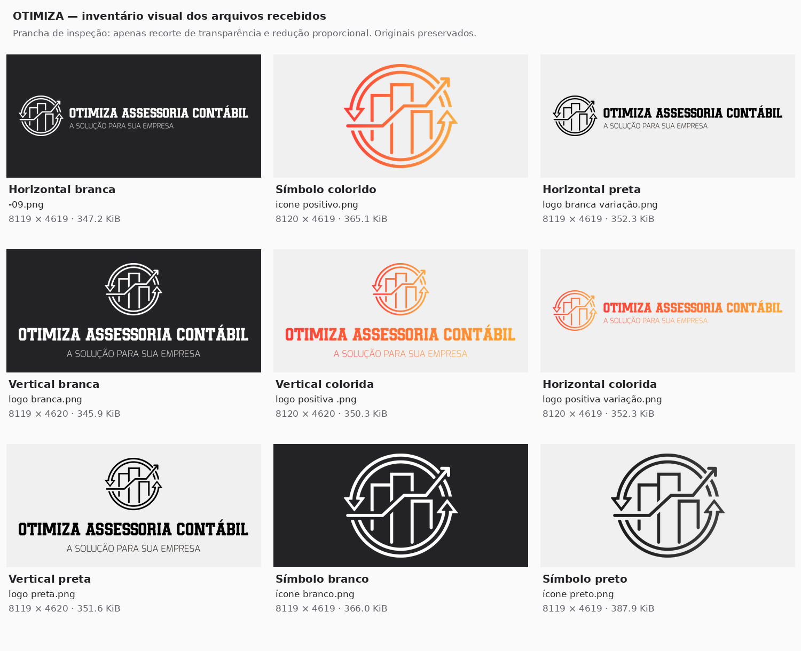

# Otimiza Assessoria Contábil — proposta para revisão

Data: 20 de setembro de 2026. Etapa: descoberta, identidade, arquitetura e wireframes. Status: proposta; implementação não iniciada.

Este documento cobre os 13 entregáveis da primeira etapa do briefing. Não foram criados Home, projeto Astro, rotas, componentes de produção ou deploy. As seções abaixo descrevem decisões propostas, não funcionalidades já implementadas. A análise do Instagram atual continua pendente de acesso e confirmação do perfil.

## 1. Materiais recebidos e evidências

A raiz contém `Otimiza.pdf` e nove PNGs. Não há pasta/arquivo chamado ENXOVAL, JPEGs, EPS, SVGs, fontes, licenças de fontes ou fotografias reais avulsas. Os PNGs disponíveis foram tratados como o conjunto oficial entregue, sem presumir que seja o enxoval completo.

O manual tem 15 páginas; foram extraídos seus textos e inspecionadas visualmente todas as páginas. Referências internas:

- Páginas 1 e 3: segurança, eficiência, agilidade e atuação além da execução contábil.
- Páginas 4–7: assinaturas colorida e monocromáticas.
- Página 8: Backed para destaque e Exo Light para texto.
- Página 9: os quatro códigos de cor informados no briefing.
- Páginas 10–13: aplicações em objetos, fachada, faixas e cartões.
- Página 14: simulações de Instagram com `otimizacontabilidade`.

As imagens de pessoas, fachada e papelaria são aplicações ilustrativas do manual; não demonstram que sejam equipe, sede ou contatos reais. O cartão usa “Nome Completo”, “Cargo”, telefone ilustrativo e endereço de exemplo: nenhum desses dados será importado para a configuração da empresa.

O briefing não contém URL explícita de Instagram. O perfil [@otimizacontabilidade](https://www.instagram.com/otimizacontabilidade/) foi identificado na página 14. A tentativa de consulta não retornou o perfil; portanto, não foi possível avaliar bio, publicações, destaques, serviços ou contatos atuais. As imagens dessa página são mockups com texto de preenchimento, não evidência de posts publicados. Esta limitação não impede a proposta preliminar, mas impede declarar a análise das três fontes integralmente concluída.

## 2. Inventário dos logotipos



A [prancha de inspeção](assets/inventario-logos.png) usa fundos de contraste, recorte de margem transparente e redução proporcional apenas para visualização. Os originais permanecem intactos. O [inventário técnico](assets/inventario-logos.json) registra dimensões, bytes, limites da arte e SHA-256.

1. **`LOGO FINAL__logo positiva variação.png`** — assinatura horizontal colorida, com símbolo à esquerda, nome e slogan. 8120 × 4619 px; 352,3 KiB.
2. **`LOGO FINAL__logo branca variação.png`** — assinatura horizontal **preta**, apesar do nome. 8119 × 4619 px; 352,3 KiB.
3. **`LOGO FINAL_-09.png`** — assinatura horizontal **branca**. 8119 × 4619 px; 347,2 KiB.
4. **`LOGO FINAL__logo positiva .png`** — assinatura vertical colorida, símbolo acima do nome. 8120 × 4620 px; 350,3 KiB.
5. **`LOGO FINAL__logo preta.png`** — assinatura vertical preta. 8119 × 4620 px; 351,6 KiB.
6. **`LOGO FINAL__logo branca.png`** — assinatura vertical branca. 8119 × 4620 px; 345,9 KiB.
7. **`LOGO FINAL__icone positivo.png`** — símbolo isolado colorido. 8120 × 4619 px; 365,1 KiB.
8. **`LOGO FINAL__ícone preto.png`** — símbolo isolado escuro. 8119 × 4619 px; 387,9 KiB.
9. **`LOGO FINAL__ícone branco.png`** — símbolo isolado branco. 8119 × 4619 px; 366,0 KiB.

Todos contêm transparência e grandes margens vazias. A proporção do arquivo não é a proporção da marca: a arte horizontal ocupa aproximadamente 5,62:1; a vertical, 2,40:1; o símbolo, 1,09:1. Esses valores servem para reservar espaço, nunca para deformar a imagem.

**Detalhe de preservação:** as versões coloridas já possuem transição de cor incorporada ao arquivo oficial. Ela será preservada como recebida. Não será aplicado novo gradiente, filtro, sombra, alteração de opacidade ou recoloração por CSS.

## 3. Assets selecionados e preparação futura

- **Header claro:** horizontal preta, proveniente de `logo branca variação.png`. Favorece leitura e deixa o laranja concentrado nos CTAs. A horizontal colorida é alternativa oficial caso a revisão prefira maior presença cromática.
- **Footer escuro:** horizontal branca, proveniente de `LOGO FINAL_-09.png`.
- **Assinatura institucional ampliada:** vertical colorida, apenas onde existir espaço para leitura confortável.
- **CTA final:** símbolo branco, pequeno, com a marca completa no footer adjacente; evitar repetição decorativa.
- **Favicon:** símbolo preto em campo claro; versão branca em campo escuro, se necessário. Validar o desenho original em 16, 32 e 48 px sem simplificar os traços.
- **Open Graph:** composição futura de 1200 × 630 px com assinatura oficial, fundo liso e título; exportação própria, sem extrair uma tela do site.
- **Fotografias:** nenhuma selecionada. Não reaproveitar as fotos ou mockups do manual como registros reais da empresa.

Após a aprovação, gerar PNGs otimizados ou WebP lossless a partir dos originais, removendo apenas a sobra transparente e restaurando margem de proteção por layout. Não vetorizar automaticamente os PNGs. A conversão para SVG só será considerada se os EPS oficiais forem entregues e a comparação visual confirmar fidelidade.

Dimensões candidatas de exportação: horizontais em 320, 640 e 960 px de largura; verticais em 480 e 960 px; símbolos em 48, 96, 192 e 512 px. Selecionar apenas os tamanhos usados. Header desktop: largura visual de 300–320 px; mobile: testar 240–268 px, mantendo menu com 44 px. A versão horizontal inclui slogan muito pequeno: se a leitura do nome falhar em 360 px, usar o símbolo oficial no header mobile, com nome acessível completo no link e identificação textual no início da página. Não remover o slogan do arquivo nem remontar a assinatura.

O manual não especifica numericamente área de proteção ou tamanho mínimo. Proponho respiro externo de pelo menos 25% da altura do símbolo, sujeito à confirmação da marca; trata-se de regra digital proposta, não regra extraída do manual.

## 4. Direção visual e posicionamento

**Recomendação: consultoria editorial.** Fundo claro predominante, texto escuro, títulos com peso, linhas finas, grid consistente e alternância entre texto aberto e listas de serviços. Duas passagens escuras estruturam a narrativa: planejamento tributário e fechamento. Laranja identifica ação; amarelo pontua pequenos detalhes.

Foram considerados três caminhos:

- **Consultoria editorial — recomendado:** aproxima a empresa de serviços profissionais especializados; funciona sem fotos e dá espaço a explicações técnicas.
- **Institucional com fotografia:** favorece proximidade humana, mas depende de fotos autênticas, nomes e autorizações que não estão disponíveis. Pode evoluir a proposta depois.
- **Predominantemente escuro:** reforça solenidade, mas reduz a leveza desejada e torna a leitura longa menos confortável. Reservar o escuro para seções pontuais.

A competência deve aparecer no conteúdo: explicar critérios, consequências e processo de análise. Sem rankings, quantidade de clientes, tempo de mercado, depoimentos, certificações ou promessas de economia não comprovados. “Experiência” poderá ser sustentada por biografias reais quando fornecidas; não será convertida em números presumidos.

Tratamento visual: títulos alinhados à esquerda, caixas com raio discreto, ausência de sombras, nenhum gráfico financeiro fictício, nenhuma imagem gerada de equipe, nenhum carrossel ou efeito de entrada necessário à leitura. Evitar usar o símbolo como textura repetida ou marca d’água com opacidade alterada.

## 5. Tokens propostos

### Cores e contraste

Tokens oficiais preservados:

- `--color-brand-orange: #ef4234`
- `--color-brand-yellow: #ffb941`
- `--color-brand-light: #FAFAFA`
- `--color-brand-dark: #232326`

Tokens funcionais adicionais, sem substituir a paleta oficial:

- `--color-surface: #FFFFFF` — superfícies pontuais.
- `--color-text: #232326` — texto principal.
- `--color-text-muted: #606066` — descrições e metadados.
- `--color-cta-text: #111111` — texto sobre o laranja oficial.
- `--color-link: #B92C22` — derivação mais escura para links em fundo claro.
- `--color-divider: #E1E1E3` — divisórias decorativas, nunca único sinal de interação.
- `--color-control-border: #8A8A8F` — limites funcionais quando necessários.
- `--color-focus-light: #232326` e `--color-focus-dark: #FFB941` — foco conforme superfície.

Contrastes calculados pela luminância relativa WCAG, com cores opacas:

- Escuro oficial sobre claro oficial: **15,02:1**.
- Texto secundário sobre claro oficial: **5,98:1**.
- Branco sobre laranja oficial: **3,82:1 — insuficiente para texto normal**.
- Escuro oficial sobre laranja oficial: **4,10:1 — também insuficiente para texto normal**.
- `#111111` sobre laranja oficial: **4,94:1 — escolha para CTA**.
- Link `#B92C22` sobre claro oficial: **5,84:1**.
- Escuro oficial sobre amarelo oficial: **9,16:1**.

Botão principal: fundo laranja oficial, texto `#111111`, peso 600, altura mínima de 48 px. Hover mantém cores aprovadas e acrescenta sublinhado; foco tem contorno externo de 2 px com afastamento de 3 px. Nenhuma informação depende apenas de cor. Links no texto são sublinhados. Amarelo não será texto pequeno em fundo claro.

O limite de 4,5:1 para texto normal e de 3:1 para texto grande vem da [WCAG 2.2, critério 1.4.3](https://www.w3.org/TR/WCAG22/#contrast-minimum). A marca tem tratamento específico na norma; os textos e controles da interface continuam sujeitos à validação.

### Escala, grid e movimento

- Espaçamento: 4, 8, 12, 16, 24, 32, 48, 64, 96 e 128 px, expresso em rem na implementação.
- Margens laterais: 16 px em 360–390; 20 px em 430; 32 px em tablet; pelo menos 40 px no desktop.
- Conteúdo: largura máxima de 1200 px; textos longos limitados a aproximadamente 65 caracteres por linha.
- Grid: 4 colunas de referência no mobile, 8 em tablet e 12 no desktop. O texto corrido mobile ocupa toda a largura útil.
- Seções: 56–64 px de respiro vertical no mobile; 96–120 px no desktop. Sem altura de viewport obrigatória no Hero.
- Raios: 0 para seções e divisórias; 4 px para botões; até 8 px para superfícies pontuais.
- Transições: 120–160 ms apenas em estados de controle; respeitar `prefers-reduced-motion`. Nenhuma animação automática.
- Camadas: conteúdo 0; header 20; CTA mobile 30; menu 40; consentimento 50. Menu aberto ou consentimento visível desativa o CTA fixo.

## 6. Tipografia web

**Backed:** confirmada visualmente no manual. Não há fonte nem licença web no projeto. Preservar somente a aplicação incorporada aos logotipos, sem extrair fonte do PDF ou procurar cópia informal.

**Títulos: Roboto Slab 600–700.** A estrutura slab serif mantém a relação com a presença e as serifas fortes de Backed, com leitura mais confortável em frases. É substituição funcional, não reprodução da fonte original. Preferir caixa de frase e evitar títulos longos em maiúsculas. O [repositório oficial](https://github.com/googlefonts/robotoslab) fornece a família e [licença Apache 2.0](https://raw.githubusercontent.com/googlefonts/robotoslab/main/LICENSE.txt).

**Corpo, navegação e botões: Exo 2 400–600.** Mantém ligação com Exo Light sem impor peso 300. A [licença oficial SIL OFL 1.1](https://raw.githubusercontent.com/google/fonts/main/ofl/exo2/OFL.txt) está disponível no repositório Google Fonts.

Arquivos ainda não foram incorporados. Na implementação: obtenção em fonte oficial, WOFF2 local, licença incluída, conjunto de caracteres que preserve acentuação portuguesa, `font-display: swap` e fallback ajustado. Preload de apenas uma fonte crítica se a medição justificar; sem Google Fonts remoto ou hotlink.

- H1 mobile: 36–40 px, entrelinha 1,12; desktop: 56–68 px, entrelinha 1,08.
- H2 mobile: 28–32 px; desktop: 40–48 px; entrelinha 1,18.
- H3: 22–26 px; entrelinha 1,25.
- Corpo: 18 px; entrelinha 1,6. Navegação e controles: pelo menos 16 px.
- Metadados: 16 px, entrelinha 1,5. Texto auxiliar não depende de cinza claro.

Tamanhos fluidos em rem, sem quebras manuais obrigatórias no H1. Confirmar reflow a 200% e 400% de zoom e suporte a espaçamento de texto personalizado.

## 7. Sitemap e condições de publicação

Mapa proposto; não equivale à confirmação de oferta comercial:

```text
/
├── sobre
├── servicos
│   ├── contabilidade-empresarial
│   ├── fiscal-e-tributario
│   ├── planejamento-tributario
│   ├── departamento-pessoal
│   ├── abertura-de-empresa
│   ├── regularizacao-de-empresas
│   ├── troca-de-contador
│   ├── bpo-financeiro
│   └── imposto-de-renda
├── conteudos
│   └── [slug]
├── perguntas-frequentes
├── contato
└── politica-de-privacidade
```

Adicionar página técnica 404, fora da navegação e do sitemap. Não abrir arquivos de categorias vazios, páginas locais em massa ou rotas de autores sem conteúdo suficiente.

**Todas as nove ofertas estão pendentes de confirmação.** O briefing especifica o conteúdo pretendido, mas pede expressamente que a oferta não seja presumida. Cada serviço terá `status: pending | confirmed | disabled`, `enabled` e `featured`. Somente `confirmed` com `enabled: true` poderá gerar página, item de menu, bloco da Home, FAQ comercial, link relacionado, schema e URL no sitemap. BPO financeiro começa desabilitado e só poderá ser ativado por confirmação explícita; Imposto de Renda também depende de escopo e público confirmados.

Se um serviço for desativado, não basta esconder seu card: a geração da rota e todos os links derivados devem acompanhar a configuração. Para uma URL já publicada, decidir redirecionamento relevante ou resposta 404/410, sem redirecionar indiscriminadamente para a Home.

## 8. Arquitetura da informação e jornadas

**Navegação desktop:** Início, Sobre, Serviços, Conteúdos, Perguntas frequentes e “Falar com um especialista”. Serviços leva ao índice; não exige mega-menu. Contato aparece no footer e no menu mobile. Marca retorna ao início.

**Jornadas prioritárias:**

- Preciso orientar uma decisão → Hero → contexto do serviço → escopo e dúvidas → WhatsApp contextual.
- Quero abrir empresa → página de abertura → decisões prévias e documentação → WhatsApp sobre abertura.
- Quero trocar de contador → página de transição → etapas e responsabilidades → WhatsApp sobre troca.
- Estou pesquisando → artigo técnico → autoria, revisão e referências → serviço relacionado → conversa.
- Quero conhecer o escritório → Sobre → profissionais reais e forma de trabalho → contato.

**Função de cada tipo de página:**

- Home: posicionamento, orientação por necessidade e entrada comercial.
- Sobre: princípios, história validada, equipe, formação, CRC e método real de atendimento. Sem espaços vazios publicados: blocos só aparecem com dados.
- Serviços: mapa de necessidades com descrições curtas e escopo confirmado.
- Serviço: resposta específica, processo, critérios técnicos, limites, FAQ e próximo passo.
- Conteúdos: biblioteca editorial, categorias visíveis apenas com artigos publicados.
- Artigo: orientação informativa com datas verdadeiras, autor, revisão técnica e referências.
- FAQ: respostas comerciais claras, com links para aprofundamento; não repetir artigos inteiros.
- Contato: WhatsApp, telefone, e-mail, horários, endereço e Instagram confirmados. Sem formulário e sem mapa incorporado por padrão; usar link externo quando houver endereço validado.
- Privacidade: descrição dos dados e fornecedores efetivamente utilizados; conteúdo final depende da operação real.

### Conteúdo específico dos serviços

- **Contabilidade empresarial:** escrituração, conciliações, balancetes, balanço, DRE e patrimônio como base para interpretar resultados; separar lucro contábil, caixa, distribuição e pró-labore sem prescrever tratamento genérico.
- **Fiscal e tributário:** operação, documentos fiscais, apuração, retenções, declarações e pendências; explicar que ICMS, ISS, PIS/Cofins, IRPJ e CSLL dependem da atividade, operação, regime e legislação vigente na publicação. Incorporar mudanças normativas apenas após revisão.
- **Planejamento tributário:** comparar cenários com atividade/CNAE, receita, margem, folha, despesas, créditos permitidos, estrutura, operação e projeções. Explicitar premissas, legalidade e limites; não reduzir a escolha à menor alíquota ou prometer economia.
- **Departamento pessoal:** admissões, folha, férias, 13º, afastamentos, rescisões, encargos, eSocial, FGTS, INSS e pró-labore conforme escopo. Mostrar fluxo de informações, responsáveis e calendário validado.
- **Abertura:** sequência de análise da atividade, CNAE, natureza jurídica, sócios, endereço, regime, registros, inscrições, licenças, notas e certificado quando aplicável. Diferenciar registro de condições para operar.
- **Regularização:** diagnóstico por órgão, cadastro, débitos, declarações e obrigações pendentes; definir prioridades e alternativas disponíveis, sem prometer certidão ou solução imediata.
- **Troca de contador:** levantamento inicial, responsabilidade por competências, documentos, procurações, situação fiscal, saldos, folha e validação de transição. Responder “como trocar”, “posso trocar” e “o que preparar”, sem prometer prazo universal.
- **BPO financeiro, somente se confirmado:** rotinas financeiras contratadas, conciliação e informação gerencial; distinguir operação financeira de escrituração contábil, com alçadas e responsabilidades claras.
- **Imposto de Renda, somente se confirmado:** definir se atende pessoa física, declarações originais/retificadoras e outras situações. Regras e calendário dependerão do exercício, de fonte oficial e de revisão profissional.

Esses tópicos são pautas de conteúdo, não orientações tributárias finais nem afirmações sobre serviços já prestados.

## 9. Arquitetura técnica e componentes

Astro + TypeScript estrito, saída estática, componentes Astro e CSS moderno com tokens. Markdown como padrão; MDX apenas quando houver benefício editorial real. Sem React, CMS, biblioteca de animação ou runtime de servidor por padrão. A [documentação de content collections](https://docs.astro.build/en/guides/content-collections/) sustenta a organização tipada do conteúdo e a geração estática das páginas.

Estrutura proposta, ainda não criada:

```text
src/
  assets/brand/             # derivados otimizados, rastreáveis aos originais
  components/
    layout/                # Container, Section, SplitSection
    navigation/            # Header, MobileNav, Footer, Breadcrumbs, SkipLink
    ui/                    # ButtonLink, TextLink, FAQAccordion
    whatsapp/              # WhatsAppLink, MobileWhatsAppCTA
    sections/              # blocos narrativos da Home
    content/               # ArticleCard, AuthorBio, ReviewNotice, References
    seo/                   # SEOHead, StructuredData
  data/
    business.ts
    services.ts
    navigation.ts
    authors.ts
  content/
    blog/                  # Markdown e referências verificadas
    services/              # conteúdo próprio de cada serviço
  content.config.ts
  layouts/                 # BaseLayout, ServiceLayout, ArticleLayout
  pages/                   # rotas propostas e 404
  styles/                  # tokens, global e utilidades pequenas
  utils/                   # WhatsApp, SEO, serviços habilitados, eventos
public/
  fonts/                   # WOFF2 locais e licenças
  brand/                   # favicon e Open Graph
```

Responsabilidades principais:

- `Header`/`MobileNav`: navegação por teclado, rota atual, foco, abertura/fechamento e alternativa utilizável sem JavaScript. Menu mobile expandido no fluxo, sem modal desnecessário; Escape fecha e devolve foco ao acionador.
- `FAQAccordion`: `details`/`summary`, resposta presente no HTML, sem biblioteca e sem interatividade em elementos semânticos incorretos.
- `WhatsAppLink`: única origem dos links comerciais; recebe mensagem, serviço e posição. Usa `buildWhatsAppUrl(message)` e número validado da configuração.
- `MobileWhatsAppCTA`: visibilidade progressiva, espaço reservado e coordenação com menu, footer e consentimento.
- `SEOHead`/`StructuredData`: metadados e entidades coerentes com o conteúdo renderizado; não gera valores para campos desconhecidos.
- `ServiceLayout`: estrutura comum de leitura; cada serviço tem introdução, problemas, processo, escopo, público, aspectos técnicos, FAQ e relacionados próprios.
- `ArticleLayout`: autoria real, revisão, datas, referências e CTA relacionado; não inventa um revisor para preencher layout.

### Dados e publicação

`business.ts`: `name`, `legalName`, `phone`, `whatsapp`, `email`, `instagram`, `address`, `city`, `state`, `postalCode`, `cnpj`, `crc`, `googleBusinessUrl`, `coordinates`, `siteUrl`, `openingHours` e `serviceArea`. O nome comercial vem do briefing; demais campos precisam de confirmação. Valores desconhecidos permanecem ausentes, nunca textos fictícios exibidos em produção.

Número de WhatsApp válido e domínio canônico serão requisitos para o build de produção. Em revisão local, a ausência deve ser sinalizada como pendência sem link falso. Não redirecionar silenciosamente CTA para outra página.

Mensagens propostas:

- Geral: “Olá, vim pelo site da Otimiza e gostaria de conversar com um especialista.”
- Planejamento: “Olá, vim pelo site da Otimiza e gostaria de conversar sobre planejamento tributário.”
- Troca: “Olá, vim pelo site da Otimiza e gostaria de entender como funciona a troca de contador.”
- Abertura: “Olá, vim pelo site da Otimiza e gostaria de conversar sobre abertura de empresa.”

Collection de artigos: `title`, `description`, `publishedAt`, `updatedAt`, `author`, `reviewedBy`, `lastReviewedAt`, `category`, `tags`, `featuredImage`, `canonical`, `references` e `status`. Imagem é opcional; autoria e revisão apontam para pessoas verificadas. Artigo técnico precisa de revisão aprovada antes de passar a publicado. Não usar data atual automática como suposta atualização editorial.

Pautas pilares iniciais: “Regime tributário: quais informações uma análise precisa considerar”; “Troca de contador: como organizar documentos e responsabilidades”; “Antes de abrir empresa: decisões que merecem análise”. São pautas, não artigos prontos. Fontes oficiais e revisão técnica serão parte da produção. Categorias previstas: Contabilidade, Tributação, Fiscal, Departamento Pessoal, Gestão e Empreendedorismo.

### SEO, mensuração e publicação futura

Título, descrição, canonical absoluto, Open Graph e Twitter por página; uma H1, hierarquia de títulos, breadcrumbs e idioma `pt-BR`. Sitemap deriva apenas das rotas publicadas usando a [integração oficial do Astro](https://docs.astro.build/en/guides/integrations-guide/sitemap/). Política única para barras finais e redirecionamentos. Preview não indexável; produção com robots coerente. `robots.txt` não substitui controle de acesso de um preview privado.

Preparar Organization/AccountingService como representação coerente da mesma empresa, WebSite, BreadcrumbList, Service e Person somente com dados reais. `AccountingService` já pertence à hierarquia de negócio local; não duplicar empresas com identificadores contraditórios. Referência: [Schema.org](https://schema.org/AccountingService). FAQPage pode descrever perguntas e respostas visíveis, sem promessa de destaque na busca: o Google informa que os resultados enriquecidos de FAQ deixaram de aparecer em maio de 2026. [Atualização oficial](https://developers.google.com/search/updates#may-2026).

GA4/GTM começam desabilitados. Configurar um único caminho de envio para evitar duplicação. Preparar `whatsapp_click`, `instagram_click`, `service_click` e `phone_click`, com `page`, `service` e `cta_position`. Sem mensagens pessoais ou dados de clientes nos eventos; navegação continua mesmo sem analytics. Search Console usa verificação de propriedade, sem script de rastreamento obrigatório.

Sem tracking opcional, não apresentar banner de consentimento sem função. Se adotado tracking sujeito a consentimento, bloquear carga e eventos até aceite, oferecer rejeição e revogação, e documentar o tratamento real na política. A empresa deve validar controlador, canal de privacidade, retenção e fornecedores antes da publicação.

Destino preservado: Hostinger Web App. Prever `pnpm install`, `pnpm dev`, `pnpm build`, `pnpm preview` e README de deploy. Confirmar no painel se o produto contratado serve `dist/` diretamente; se exigir processo Node, definir o servidor mínimo adequado sem transformar o site em SSR desnecessariamente. `pnpm preview` será ferramenta de validação local, não decisão automática de servidor de produção. Nada será registrado ou publicado em Sites, Vercel ou Netlify nesta etapa.

## 10. Wireframe textual detalhado da Home

A ordem abaixo estabelece a narrativa. Seções comerciais dependem da confirmação dos serviços. Textos são propostas para revisão editorial pela Otimiza.

### 01 — Header

Fundo claro; altura aproximada de 88 px no desktop. Logo horizontal preta à esquerda; navegação central/direita; CTA laranja ao final. Uma borda inferior discreta. Skip link como primeiro elemento focável. Sem menu de vários níveis na primeira versão.

### 02 — Hero: conhecimento aplicado à decisão

Fundo `#FAFAFA`; grid 8/4 no desktop, com texto principal amplo e nota editorial curta na coluna secundária. Sem imagem, dashboard ou gráfico ilustrativo.

Etiqueta: “Assessoria contábil para empresas”.

**H1: “Contabilidade para decisões que exigem conhecimento de verdade.”**

Apoio: “Números, legislação e contexto precisam ser analisados juntos. Conte com orientação contábil para compreender os impactos de cada decisão no seu negócio.”

CTA primário: “Falar com um especialista”, WhatsApp geral. Secundário: “Conhecer nossos serviços”, `/servicos`.

Nota editorial: “Toda decisão tem um contexto.” Abaixo, três linhas breves: “A operação da empresa. As obrigações envolvidas. As consequências de cada escolha.” Não apresentar esses itens como indicadores ou estatísticas.

### 03 — Faixa institucional

Uma linha editorial com “Segurança · Qualidade · Agilidade · Dedicação”. Tipografia de 16–18 px, bordas horizontais leves e bastante respiro. Mobile quebra em duas linhas, sem rolagem horizontal. Não transformar valores em quatro cards.

### 04 — Há decisões que não admitem achismo

H2 à esquerda, explicação e lista à direita no desktop; tudo em sequência no mobile.

Texto: “Uma escolha tributária, uma mudança societária ou uma contratação produz efeitos que precisam ser compreendidos antes da decisão.”

Quatro pontos com título curto e uma frase: regime tributário e cenário da operação; estrutura societária e responsabilidades; conformidade fiscal e documentação; folha e obrigações trabalhistas. Fechamento: “A orientação começa pela análise do seu contexto.” Sem linguagem de medo ou garantia absoluta.

### 05 — Serviços organizados por necessidade

H2: “O apoio contábil que cada etapa exige.” Introdução curta e link “Ver todos os serviços”. Até seis ofertas confirmadas, priorizadas pela empresa.

Desktop: duas colunas com divisórias. Mobile: lista única. Cada item contém título, descrição específica de até duas frases, benefício contextual e link nomeado (“Entender a contabilidade empresarial”, por exemplo). Sem ícone gigante ou botão duplicado em cada item.

Candidatos para destaque: contabilidade empresarial, fiscal e tributário, planejamento, departamento pessoal, abertura e troca. Regularização pode substituir um deles conforme prioridade comercial. BPO e IR não entram automaticamente.

### 06 — Método e proximidade

H2: “Conhecimento para interpretar. Proximidade para orientar.” A formulação não depende de um tempo de experiência ainda não documentado.

Composição aberta: três passos — entender a operação; analisar informações e obrigações; orientar o próximo passo. Explicar o que o cliente fornece e como recebe orientação, após validação do processo real da empresa.

Link: “Conheça a Otimiza”, `/sobre`. Quando houver equipe e credenciais confirmadas, incorporar um bloco humano autêntico; não deixar molduras de fotos vazias.

### 07 — Planejamento tributário

Seção escura, texto claro, pequeno detalhe amarelo. H2: “A decisão tributária começa antes da apuração.”

Texto: “Atividade, margem, folha, despesas e estrutura da operação precisam fazer parte da análise. O planejamento compara cenários e considera o que a legislação permite.”

Quatro critérios em lista tipográfica: operação; regime; projeções; consequências. Link para aprofundar no serviço e CTA “Conversar sobre planejamento tributário”, com mensagem própria. Nenhuma porcentagem de economia. Omitir integralmente se o serviço não for confirmado.

### 08 — Troca de contador

Retorno ao fundo claro. H2: “Seu contador deveria ajudar a esclarecer decisões.”

Texto: “A mudança começa com um levantamento: documentos, obrigações, saldos e responsabilidades precisam estar organizados para conduzir a transição.”

Sequência numerada discreta: levantamento → alinhamento da transição → conferência das informações. CTA “Entender como trocar de contador”, WhatsApp próprio; link textual para a página. Sem crítica a concorrentes ou promessa de troca sem participação do cliente. Omitir se não confirmado.

### 09 — Conteúdos

H2: “Conhecimento para avaliar o próximo passo.” Exibir até três artigos efetivamente publicados e revisados. Categoria, título, descrição, data e link contextual; sem imagem obrigatória ou data fictícia. Duas/três colunas no desktop, lista vertical no mobile.

Se não houver artigos prontos, retirar essa seção da Home e não publicar uma biblioteca vazia. A estrutura de conteúdo permanece preparada.

### 10 — Perguntas frequentes

H2: “Antes de conversar, esclareça algumas dúvidas.” Cinco perguntas iniciais para a equipe responder e aprovar: “O que preciso apresentar na primeira conversa?”; “Como funciona a troca de contador?”; “O que é avaliado no planejamento tributário?”; “Quais decisões vêm antes de abrir uma empresa?”; “Como funciona o atendimento da Otimiza?”.

Respostas curtas, específicas e coerentes com oferta e atendimento confirmados; links para aprofundamento. Accordion nativo, com toda a pergunta dentro da área acionável. Link final para `/perguntas-frequentes`.

### 11 — Convite final

Fundo escuro; símbolo oficial branco pequeno. H2: “Tem uma decisão contábil ou tributária importante pela frente?”

Texto: “Converse com quem pode analisar o contexto antes de indicar o caminho.” CTA laranja com texto escuro acessível: “Falar com um especialista”. Mensagem geral de WhatsApp. Sem formulário, urgência artificial ou prazo de resposta inventado.

### 12 — Footer

Continuação escura, separação por borda. Logo branca horizontal; mensagem institucional do manual em texto; links de navegação; contato e dados empresariais confirmados; Instagram; política de privacidade e preferências de cookies somente quando existirem.

Desktop em três áreas; mobile empilhado, com telefone e WhatsApp alcançáveis. Endereço, CNPJ e CRC não aparecem enquanto faltarem dados. Nenhum logotipo de cliente, selo ou avaliação presumida.

## 11. Wireframe mobile

Referência principal: 390 × 844 px; primeiro testar também 360 × 800. A ordem do DOM acompanha a leitura em todas as larguras.

```text
┌─────────────────────────────────┐
│ Logo oficial          [Menu]    │  Header compacto; alvo ≥ 44 px
├─────────────────────────────────┤
│ Assessoria contábil              │
│                                 │
│ Contabilidade para decisões     │
│ que exigem conhecimento         │  Quebras naturais, sem <br> fixo
│ de verdade.                     │
│                                 │
│ Apoio curto e legível            │
│ [ Falar com um especialista ]    │  Botão em largura útil
│ Conhecer nossos serviços →      │  Link com área de toque
│                                 │
│ Nota editorial resumida          │
├─────────────────────────────────┤
│ Segurança · Qualidade           │
│ Agilidade · Dedicação           │
├─────────────────────────────────┤
│ Há decisões que não             │
│ admitem achismo                 │
│ Texto + quatro pontos           │
├─────────────────────────────────┤
│ Serviços                        │
│ Título / descrição / link       │
│ ─────────────────────────────── │
│ Título / descrição / link       │  Lista vertical, sem carrossel
├─────────────────────────────────┤
│ Método e proximidade            │
│ 01 Entender                     │
│ 02 Analisar                     │
│ 03 Orientar                     │
├─────────────────────────────────┤
│ Planejamento tributário         │  Fundo escuro
│ Critérios + CTA contextual      │
├─────────────────────────────────┤
│ Troca de contador               │
│ Passos + CTA contextual         │
├─────────────────────────────────┤
│ Conteúdos em lista              │
├─────────────────────────────────┤
│ FAQ                             │
│ Pergunta                     +  │
├─────────────────────────────────┤
│ Convite final + WhatsApp        │  Fundo escuro
├─────────────────────────────────┤
│ Footer / contato / privacidade  │
└─────────────────────────────────┘

Quando apropriado, fixo na viewport:
[       Falar pelo WhatsApp       ]
```

O diagrama representa sequência, não uma única tela. Não comprimir texto ou remover conteúdo para forçar Hero inteiro acima da dobra. Buscar H1, apoio e CTA principal acessíveis na primeira tela nas dimensões de referência, validando com as fontes reais.

**Header/menu:** aproximadamente 72 px, sem CTA adicional espremido ao lado da marca. O CTA inicial está no Hero. Menu abre no fluxo abaixo do header; botão expõe estado e nome “Abrir menu”/“Fechar menu”. Menu de links verticais inclui Contato e CTA. Sem armadilha de foco; teclado, Escape e retorno de foco testados. Sem JavaScript, a navegação continua disponível por HTML de fallback.

**CTA fixo:** botão de 48 px, container de cerca de 64 px mais `env(safe-area-inset-bottom)`. Só é ativado quando o CTA do Hero sai de vista; suprimido quando outro CTA comercial estiver visível, durante menu/consentimento e ao entrar no bloco final/footer. Reservar espaço no documento e margem de rolagem para impedir sobreposição de conteúdo e foco. Com JavaScript indisponível, fica ausente e os CTAs normais continuam operantes. Não alternar sua visibilidade movendo o conteúdo.

**Consentimento futuro:** se necessário, seus controles têm prioridade; esconder a barra fixa enquanto o aviso estiver aberto. Rejeitar e aceitar com clareza equivalente. Não criar uma segunda camada flutuante permanente.

**Adaptação:** 360/375/390/430 mantêm coluna única e sem texto justificado; 768 permite duas colunas onde houver espaço; 1024 pode manter menu compacto se os links não couberem; 1280/1440/1920 usam grid de 12 colunas com largura máxima. Nenhuma mudança depende de um breakpoint arbitrário que provoque colisão do header.

## 12. Critérios de validação da implementação futura

Esses testes ainda não foram executados porque o site não foi implementado.

- `pnpm build` e verificação TypeScript/Astro; rotas ativas e desativadas, links internos, 404 real, arquivos e ausência de links de exemplo.
- Metadados individuais, canonical no domínio correto, sitemap/robots, Open Graph, schema sem campos inventados e navegação consistente com serviços habilitados.
- Responsividade em 360×800, 375×812, 390×844, 430×932, 768×1024 e 1440×900; verificar também transições em 1024/1280 e limite em 1920.
- Teclado, foco visível e não encoberto, menu, FAQ, leitores de tela, landmarks, H1/H2/H3, alt text, zoom, contraste e alvos de 44 px adotados pelo projeto.
- Imagens com dimensões, `srcset` quando apropriado e lazy-loading abaixo da dobra; sem lazy-loading na marca crítica. Fontes locais e JS apenas para melhorias necessárias.
- Lighthouse mobile e desktop no build de produção; registrar ambiente e mediana de três execuções por página representativa, incluindo Home, serviço e artigo. Metas: performance 95–100 e demais categorias 100, sem tratá-las como garantia de acessibilidade completa.
- Orçamento inicial proposto, a medir: JS próprio até 15 KiB gzip sem analytics; CSS até 30 KiB gzip; fontes até 100 KiB; logo de header até 25 KiB. Rever quando houver medições reais.
- LCP < 2,5 s, alvo interno ≤ 1,8 s; INP < 200 ms; CLS < 0,1. Lighthouse é medição de laboratório: não afirmar INP real sem dados de uso em campo. Medir Core Web Vitals após publicação quando houver amostra suficiente.

## 13. Informações reais que faltam

### Para fechar a direção e o escopo

1. Confirmação do Instagram atual e acesso ao conteúdo público para análise.
2. Confirmação individual dos nove serviços, com BPO explicitamente habilitado ou excluído; escopo do Imposto de Renda.
3. Serviços prioritários, perfis de cliente, segmentos atendidos, abrangência geográfica e capacidade de atendimento presencial/remoto.
4. Existência do enxoval completo com EPS/JPEG e eventuais versões compactas oficiais; licença web de Backed, se houver.

### Para publicar contato, autoridade e SEO local

5. WhatsApp com DDI/DDD, telefone, e-mail, horário de atendimento e responsável comercial.
6. Razão social, CNPJ, CRC da organização e dos profissionais quando aplicável.
7. Endereço, cidade, UF, CEP, área de atendimento e link do Google Business Profile; coordenadas apenas após validar a localização.
8. História, ano de fundação, fundadores, nomes, cargos, formação, experiência verificável e biografias da equipe.
9. Fotos reais e autorizações de uso; nenhum espaço fotográfico será preenchido com equipe fictícia.
10. Processo real de atendimento, documentos solicitados, escopo contratual e transição contábil.
11. Autor e revisor técnico dos artigos; fluxo e periodicidade de revisão; referências oficiais para cada publicação.

### Para publicação técnica e privacidade

12. Domínio final e acesso ao plano Hostinger Web App, incluindo método de deploy e suporte de execução/arquivos estáticos.
13. Decisão sobre GA4/GTM, IDs e propriedade Search Console. Podem permanecer desativados até confirmação.
14. Dados do controlador, contato de privacidade, fornecedores efetivos e retenção de dados para redigir uma política fiel à operação.

**Decisões submetidas à revisão:** direção editorial clara; header monocromático oficial; Roboto Slab + Exo 2; laranja oficial com texto `#111111` nos CTAs; narrativa da Home; regras de publicação dos serviços. Esta entrega se encerra na revisão solicitada. A Home só será implementada após o retorno sobre esta proposta.
